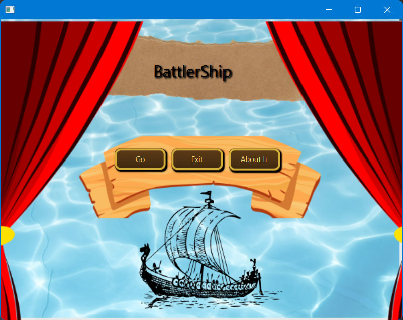
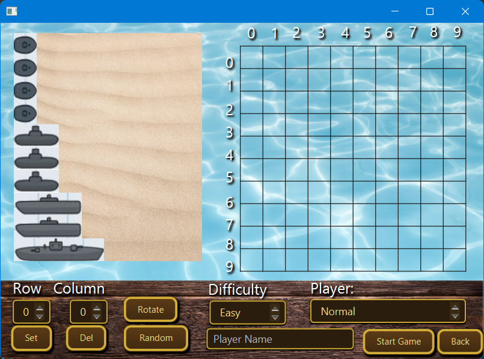
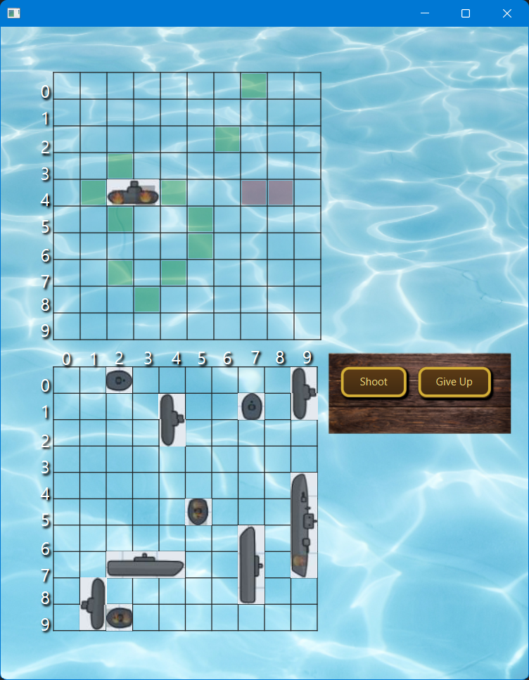

# ⚓ BatallaNaval

**BatallaNaval** es una versión simplificada del clásico juego *Battleship*, desarrollada con Java y JavaFX. Este proyecto fue creado con fines educativos y de práctica, no como una versión profesional del juego.

  
  

---

## 🚀 Tecnologías utilizadas

- Java 23 (JDK más reciente)
- JavaFX
- CSS
- Maven
- NetBeans (recomendado)

---

## 🛠 Requisitos

Asegúrate de tener instalado lo siguiente antes de ejecutar el proyecto:

- **Java JDK 23**
- **JavaFX** (compatible con JDK 23)
- **Maven**
- **NetBeans** (u otro IDE compatible con Maven y JavaFX)

---

## 🧑‍💻 Autor

Este proyecto fue desarrollado por **Fwolagos**, con mucho cariño, esfuerzo y algo de café ☕.

---

## 📜 Licencia

Este proyecto está bajo la licencia especificada en el archivo [`LICENSE`](./LICENSE) incluido en el repositorio.

---

## 📷 Capturas

A continuación, algunas imágenes del juego en acción:

  
  

---

¡Gracias por pasarte por aquí! ⭐ Si te gustó el proyecto, no olvides dejar una estrellita.
